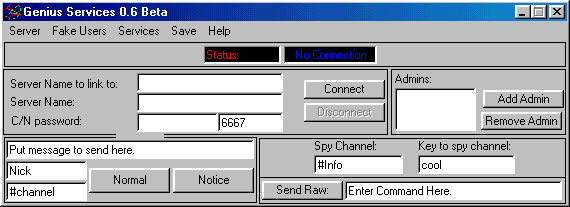



## Genius IRC Services 0\.6

### Description

This is the source code to 'Genius IRC Services'. This program is designed as an administration tool for people who run an IRC Server(IRCD). The services connect to your IRC server and set up some services bots(IRCop, Color, Nick, etc...) that perform functions for the users and admins of the server. Some of the features of this program include: Adding thousands of 'fake' users to your server for stability testing, A channel in which a bot relays all things that happen on the server, Colored nicknames, The ability to send raw commands to the server, etc... Genius IRC Services was designed and tested to work on DF and DF variants, Elite IRCD and Unreal IRCD.
 
### More Info
 

             |
---                |---
**Submitted On**   |2001-01-25 18:27:36
**By**             |[Cheese Banana](https://github.com/Planet-Source-Code/PSCIndex/blob/master/ByAuthor/cheese-banana.md)
**Level**          |Intermediate
**User Rating**    |4.0 (24 globes from 6 users)
**Compatibility**  |VB 4\.0 \(32\-bit\), VB 5\.0, VB 6\.0
**Category**       |[Complete Applications](https://github.com/Planet-Source-Code/PSCIndex/blob/master/ByCategory/complete-applications__1-27.md)
**World**          |[Visual Basic](https://github.com/Planet-Source-Code/PSCIndex/blob/master/ByWorld/visual-basic.md)
**Archive File**   |[CODE\_UPLOAD141751252001\.zip](https://github.com/Planet-Source-Code/cheese-banana-genius-irc-services-0-6__1-14725/archive/master.zip)

